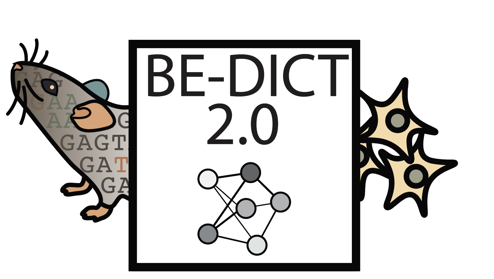

# BEDICT-V2:Predicting base editing outcomes with an attention-based deep learning algorithm Predicting base editing outcomes with an attention-based deep learning algorithm
<div style="text-align:center">

</div>
=======


Brief project description.

## Environment Setup

### Step 1: Create a Virtual Environment

```bash
# Create a virtual environment
conda create --name bedict_2

conda activate bedict_2

pip install -r requirements.txt

