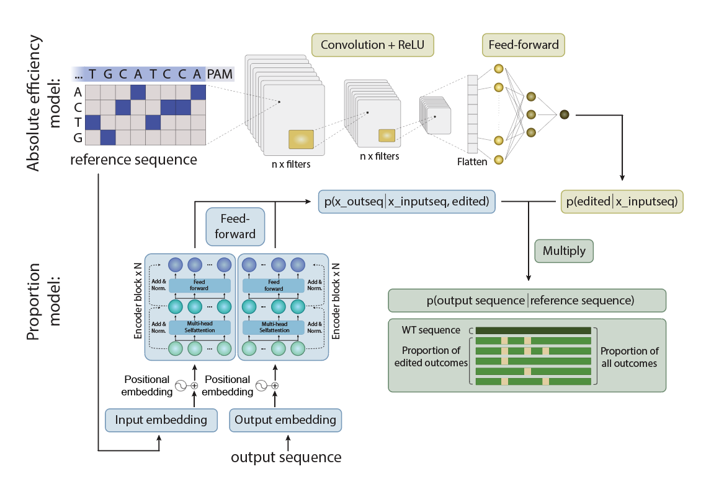

# BEDICT-V2:Predicting base editing outcomes with an attention-based deep learning algorithm

<p align="center">
  
</p>

---

## Overview

BEDICT-V2 is a deep learning model designed to predict base editing outcomes using an attention-based algorithm. This repository provides the source code and instructions for using the model. We also have a [web app you can try out here](https://go.bedict.app/).
https://go.bedict.app/
<p align="center">
  
</p>
---

## Table of Contents

- [Environment Setup](#environment-setup)
  - [Step 1: Create a Virtual Environment](#step-1-create-a-virtual-environment)
- [Usage](#usage)
  - [Try the Model on Your Own Sequence](#try-the-model-on-your-own-sequence)
  - [Retrain the Model](#retrain-the-model)
- [Contributing](#contributing)
- [License](#license)

---
## The folder structure:
```
packages/button
├── absolute_efficiency_model
│   ├── models
│   ├── output
│   └── src
├── dataset
├── main_py_files
│   ├── train.py
│   ├── ....
│   └──inference.py
├── dataset
├── notebooks
├── proportion_model
│   ├── output
│   └── src
├── utils
├── web_application
│   ├── templates
│   ├── static
│   └── app.y
├── README.md
└── requirment.txt
```

## Environment Setup

### Set up the environment

Create a virtual environment and install the required dependencies using [Conda](https://docs.conda.io/en/latest/):

```bash
# Create a virtual environment
conda create --name bedict_v2

# Activate the virtual environment
conda activate bedict_v2

# install python
conda install -c anaconda python=3.10

conda install pytorch torchvision cudatoolkit=10.1 -c pytorch

# Install dependencies
pip install -r requirements.txt

```

## Usage

## Usage

### Run Inference on Custom Sequences

You can use the pre-trained BEDICT-V2 models to run inference on your own DNA sequences. Choose between running locally via a notebook or using our web app.

---

### 🧪 Option 1: Local Inference Using the Notebook

1. **Prepare your input file:**

   - Create an Excel file with:
     - **Target sequences** (20 bases long)
     - **PAM sequences** (4 bases long)
   - Place this file in the `dataset/` directory.

2. **Open the notebook:**

   Navigate to the `notebooks/` folder and open `Inference_user_defined_sequence.ipynb`.

3. **Configure your run:**

   In the notebook, specify:
   - The **input Excel file name**
   - The **editor name** (e.g., ABE8e-NG)
   - Whether you're predicting **in vivo** or **in vitro**

4. **Run inference:**

   The notebook will automatically run:
   - The **absolute efficiency model**
   - The **proportional model**

   It will then merge the predictions into a final result table.

---

### 🌐 Option 2: Use the Web App (Easiest)

The easiest way to use BEDICT-V2 is through our [web app](https://go.bedict.app/). Just upload your sequences and get results instantly — no setup required!

---

### 📦 Note on Pre-trained Models

Pre-trained models are already included in the repository under corresponding folders, such as BEDICT-V2/absolute_efficiency_model/output/...


## Train the model on your own dataset

To deploy our model on your dataset, where you will train our model on your screening data, follow these steps:
---

1. **Prepare the data:**

There is an example data you will find in the dataset store in exel file, where it includes columsn with target protospacer (20 bases), pam information (four bases), and outcome sequence (20 bases)

2.  **Pre-process the data:**

Go to the foler main_py_files and run generate_two_stage_model_data, input the exel file name

```bash
python inference.py
```

2.  **Train the model:**

Go to the foler main_py_files and call inference.py file, before that, you can select the method (in vivo or in vitro), editor in the config file and run inference.py


2.  **Infer the model:**

Go to the foler main_py_files and call inference.py file, before that, you can select the method (in vivo or in vitro), editor in the config file and run inference.py

## License
[License](LICENSE)
